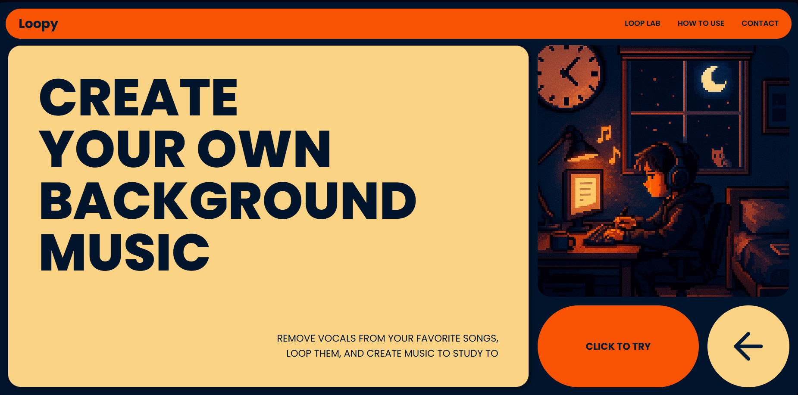

# Loopy Tune Demucs - Frontend

This is the frontend for Loopy Tune Demucs, a web application designed to create seamless background music loops from your favorite songs. It provides a sleek, modern, and interactive user interface for uploading a song, removing its vocals, selecting a perfect loop segment, and generating a final audio file ready for download.



---

## Features

- **Intuitive File Upload**: Supports both drag-and-drop and traditional file selection for `.mp3` and `.wav` files.
- **Vocal Removal**: Integrates with the `demucs` backend to seamlessly strip vocals from uploaded tracks.
- **Interactive Waveform Visualization**: Uses WaveSurfer.js to display the audio waveform, allowing for precise visual selection of the loop region.
- **Region Looping & Preview**: Users can select a specific segment of the processed audio and preview the loop in real-time.
- **Customizable Loop Duration**: Specify the total length of the final looped audio in minutes.
- **Dynamic UI**: The interface fluidly guides the user through each step of the process, from uploading to downloading.
- **Engaging Loading Animations**: Custom-built, theme-consistent animations provide visual feedback during processing and looping.
- **Responsive Design**: The layout is built with modern CSS (Flexbox and Tailwind CSS) to adapt to various screen sizes.
- **Download Your Creation**: Once the loop is generated, it can be easily downloaded as an `.mp3` file.

---

## Tech Stack

- **Framework**: [React](https://react.dev/)
- **Language**: [TypeScript](https://www.typescriptlang.org/)
- **Build Tool**: [Vite](https://vitejs.dev/)
- **Styling**: [Tailwind CSS](https://tailwindcss.com/)
- **UI Components**: [shadcn/ui](https://ui.shadcn.com/)
- **Audio Visualization**: [WaveSurfer.js](https://wavesurfer.xyz/)

---

## Getting Started

To get the frontend up and running on your local machine, follow these simple steps.

### Prerequisites

- [Node.js](https://nodejs.org/) (v18 or later recommended)
- [npm](https://www.npmjs.com/) or `yarn`

### Installation

1.  **Navigate to the frontend directory**:
    ```bash
    cd LOOPY-audio-stem-transformer
    ```
2.  **Install dependencies**:
    ```bash
    npm install
    ```

### Running the Development Server

1.  **Start the dev server**:
    ```bash
    npm run dev
    ```
2.  **Open in your browser**:
    Navigate to `http://localhost:5173` (or the URL provided by Vite).

> **Note**: This frontend requires the [corresponding backend](https://github.com/Kart8ik/LOOPY-audio-stem-transformer-backend/) to be running simultaneously to handle file processing and looping. By default, it expects the backend to be available at `http://localhost:3000`.

---

## Project Structure

The project follows a standard Vite + React project structure:

```
loopy_frontend/
├── public/              # Static assets
├── src/
│   ├── assets/          # Images and other static assets
│   ├── components/      # Reusable UI components (Navbar, ui/*)
│   ├── lib/             # Utility functions (e.g., cn)
│   ├── pages/           # Main application views (Home, Loopy, Processing)
│   ├── App.tsx          # Main application component and router setup
│   └── main.tsx         # Entry point of the application
├── index.html           # Main HTML file
├── package.json         # Project dependencies and scripts
└── vite.config.ts       # Vite configuration
```
